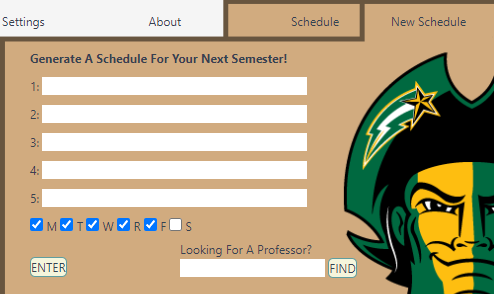
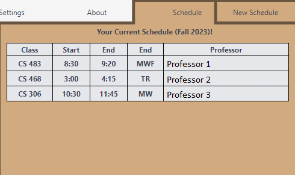

# CS 321: GMU Course Generator Browser Extension

#### By Cody Querubin, Aadya Kamath, Anthony Bazar

Are you struggling with planning what courses to take for next semester? Did the course that you wanted to take get filled up and now you need to find another class? Well, have no fear, the GMU Course Generator Browser Extension is here! This browser extension is used to help GMU students generate a schedule, with the best-rated professors. With inputting the course the user wants to take, as well as the help of a few button clicking, the extension will generate a schedule for them in minutes!

### Structure
There are two components of this project, the front-end and the back-end. The front-end code is found in the interface directory, while the back-end code is everything around it.
- The front-end mainly used HTML, CSS/Bootstrap, and JavaScript for displaying buttons and doing action-handling.
- The back-end is mainly JavaScript, which is used to scrape information from RateMyProfessor and the George Mason PatriotWeb course list.

### Dependencies
Here are a list of tools used (certain tools might need to be installed through npm install)
- tailwind
- node.js
- html
- puppeteer
- sqlite3
- calender
- css
- express.js
- cookie-parser
- morgan

### How To Run The Browser Extension
The first thing to do is load the browser extension onto the browser. To do this, you need to load the manifest.json file when adding custom browser extensions.

The second thing is to run the back-end code on your local machine. To do this, run this command:
#### `node .\app.js`

### UI of the Extension

